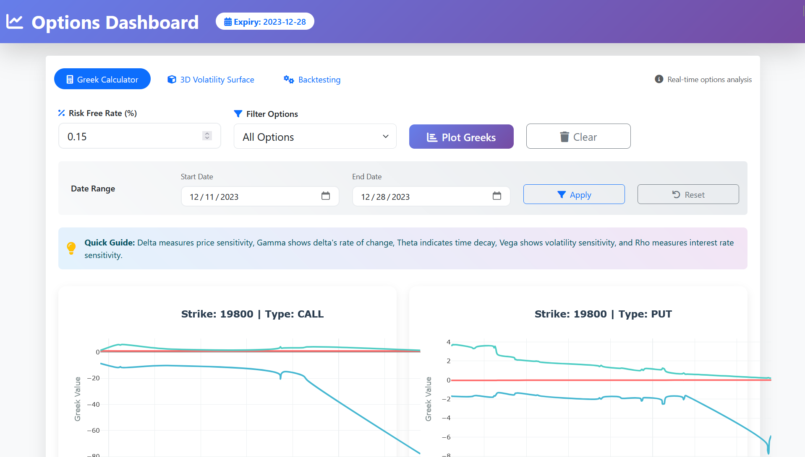
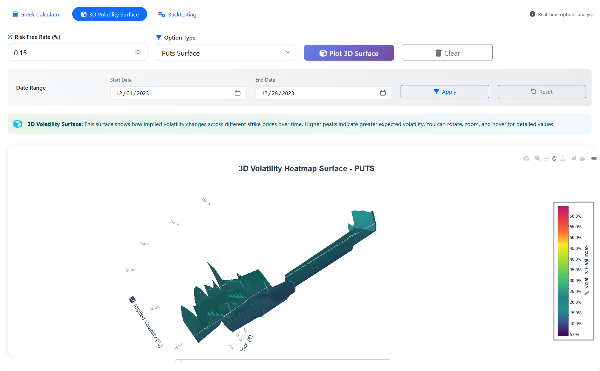
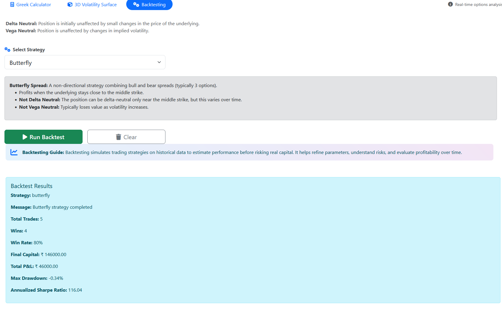

# 📈 Options Dash


> **Options Dash** is a **web-based analytics dashboard** for options traders, analysts, and researchers.  
> It provides tools to calculate **Implied Volatility (IV)**, compute **Options Greeks**, and backtest popular strategies.  

---
## Installation

### **Prerequisites**
- Python **3.9+**
- `pip`
- `git`

### **Setup**
```bash
# Clone the repository
git clone https://github.com/amanu242006/Options-Dash.git
cd Options-Dash

# Install dependencies
pip install -r requirements.txt

# Run the development server
python options_dashboard/manage.py runserver
```

Visit in your browser:  
**http://127.0.0.1:8000/**

---
## 🚀 Features

### **1. Implied Volatility (IV) Calculator**
- **Inputs**:  
  - Risk-Free Rate (%)  
  - Option Type Filter (All, Calls, Puts)  
  - Date Range Selection  
- **Outputs**:  
  - Interactive IV plot  
  - Interpretation guide:
    - Higher IV → Higher expected price movement  
    - Lower IV → Lower volatility near expiration  

### **2. Options Greeks Calculator**
Calculates:
- **Delta** – Sensitivity to underlying price changes  
- **Gamma** – Sensitivity of Delta to price changes  
- **Theta** – Time decay of option value  
- **Vega** – Sensitivity to volatility changes  
- **Rho** – Sensitivity to interest rate changes  

### **3. Backtesting Module**
- Strategies: **Straddle**, **Butterfly**, **Strangle**  
- **Outputs**:
  - Total trades, wins, win rate  
  - Final capital & total P&L  
  - Maximum drawdown  
  - Annualized Sharpe ratio  
  - Optional performance graphs  

---

## 📊 Example Results

| Strategy  | Trades | Wins | Win Rate | Final Capital | Total P&L | Max Drawdown | Sharpe Ratio |
|-----------|--------|------|----------|--------------:|----------:|-------------:|-------------:|
| Straddle  | 11     | 8    | 72.73%   | 108,372.50    | 8,372.50  | -2.45%       | 121.79       |
| Butterfly | 5      | 4    | 80%      | 146,000.00    | 46,000.00 | -0.34%       | 116.04       |
| Strangle  | 9      | 6    | 66%      | 123,018.00    | 23,018.00 | -1.84%       | 119.64       |

---

## 🛠 How It Works

### **Implied Volatility**
- Based on **Black–Scholes** option pricing model  
- Uses `scipy.optimize.brentq` to solve for volatility (σ)  
- Matches observed market prices to model price  

### **Greeks**
Derived from Black–Scholes partial derivatives:
```
Δ = ∂Price/∂S  
Γ = ∂²Price/∂S²  
Θ = ∂Price/∂T  
Vega = ∂Price/∂σ  
Rho = ∂Price/∂r
```
Implemented using **NumPy** & **SciPy**.

### **Backtesting**
- Separate Python functions for each strategy  
- Performance metrics stored in dictionaries  
- Graphs optionally loaded via **PIL**  

---


## 🖼 Screenshots

| Dashboard View | IV Calculator | Backtesting Results |
|----------------|--------------|---------------------|
|  |  |  |

---

## 🛠 Troubleshooting

**Error:**  
`Failed to load IV data: Network response was not ok.`  

**Fix:**  
- Check your internet connection  
- Verify the data source/API is active  
- Open browser console (F12) and inspect logs  

---

## 📜 License
This project is licensed under the terms in the [LICENSE](LICENSE) file.

---


